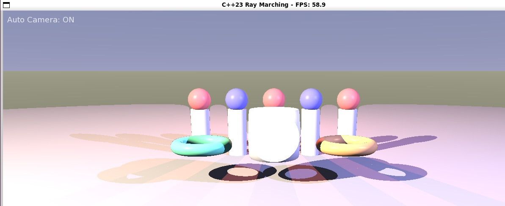

# C++ Ray Marching Renderer

A modern C++23 implementation of a ray marching renderer using Signed Distance Functions (SDFs) and SFML for visualization.

\

## Demo



## Features

- Fast ray marching using signed distance functions (SDFs)
- Interactive camera controls
- Physically-based material system with metallic/roughness properties
- Atmospheric lighting with soft shadows
- Multi-threaded rendering using C++23 features
- GPU-like rendering pipeline implemented entirely on the CPU
- Interactive controls for camera movement and quality settings

## Requirements

- C++23 compatible compiler (Clang 16+ or GCC 13+ recommended)
- CMake 3.22+
- SFML 2.6+

## Building the Project

### Using Clang (Recommended)

```bash
./build-clang.sh
```

### Using GCC

```bash
./build-gcc.sh
```

## Running the Application

After building, you can run the ray marcher with:

```bash
./build-clang/raymarch
```

Or if you built with GCC:

```bash
./build/raymarch
```

## Controls

| Key               | Action                              |
|-------------------|-------------------------------------|
| W, A, S, D        | Move camera forward, left, back, right |
| Q, E              | Move camera up, down                |
| Arrow Keys        | Rotate camera                       |
| Space             | Toggle between auto and manual camera mode |
| R                 | Increase samples per pixel (higher quality) |
| F                 | Decrease samples per pixel (faster rendering) |
| Escape            | Exit application                    |

## Scene Construction

The scene is built using Signed Distance Functions (SDFs) which enable complex geometry to be defined mathematically. The current scene includes:

- Procedurally placed pillars with glowing spheres
- Reflective tori with metallic properties
- A central complex shape created by CSG operations
- Atmospheric lighting with dramatic shadows
- Custom sky and ground gradients

## Technical Details

### Ray Marching Algorithm

Unlike traditional ray tracing, ray marching works by stepping along a ray in variable increments until an intersection is found. This method excels at rendering:

- Complex mathematical surfaces
- Procedurally generated geometry
- CSG (Constructive Solid Geometry) operations
- Fractal structures

### C++23 Features

This project leverages modern C++ features including:

- C++20 modules for improved compilation speed
- Concepts and constraints for generic programming
- std::format for string formatting
- Multithreaded rendering using std::thread and atomics

## Project Structure

- `src/` - Source code files
  - `main.cpp` - Application entry point
  - `modules/` - C++ module implementations
    - `camera.cpp` - Camera module implementation (with rm namespace)
    - `common.cpp` - Common utilities and data structures
    - `renderer.cpp` - Rendering pipeline implementation
    - `scene.cpp` - Scene graph and SDF implementations
    - Note: The `.cppm` files are reference files, not used in the build
- `include/` - Header files (traditional includes for non-modular code)
- `build-clang.sh` - Build script for Clang (recommended)
- `build-gcc.sh` - Build script for GCC

## License

This project is licensed under the MIT License - see the LICENSE file for details.

## Acknowledgments

- [Inigo Quilez](https://iquilezles.org/articles/) for his excellent resources on SDFs and ray marching
- The SFML team for their simple and effective multimedia library
EOF < /dev/null
